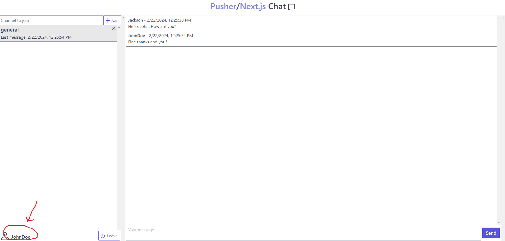
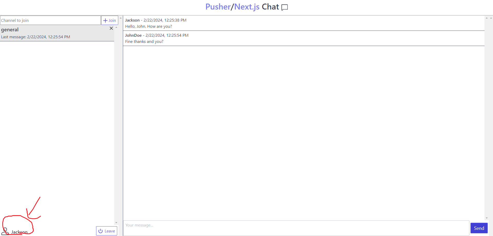

# Pusher Chatroom

> Demonstrates creating a real-time chatroom using [Pusher](https://pusher.com) and [Next.js](https://nextjs.org)

## Features

- Joining with just a display name
- Creation/joining/leaving of Chatrooms
- Sending text/links/code blocks
- Muting specific users

## Libraries used

- [pusher-js](https://github.com/pusher/pusher-js)
- [Next.js](https://github.com/zeit/next.js)
- [Spectre.css](https://github.com/picturepan2/spectre)

## Getting Started

1. Clone this repo `git clone https://github.com/Tymursabrove/pusherJs-next-chatroom.git`
2. Install dependencies `cd pusher-chatroom && yarn`
3. Start development server `yarn dev`

## Deploying

1. Install `now` if not already installed `npm i -g now@latest`
2. Login if not already
3. Add secrets for Pusher `now secrets add PUSHER_KEY <value>` (see now.json for needed values)
4. Change to project directory and run `now`

## Potential improvements

- Add bad-word filtering with an API endpoint
- Send messages through API to prevent spam

## Downsides to current implementation

- limited to 10 messages per second per client [docs](https://pusher.com/docs/channels/using_channels/events#triggering-client-events)
- can be abused since there isn't server-side filtering
- can have username collision (spoofing) since there isn't authentication/checking
- messages aren't persisted since there isn't a DB connected
- image uploads aren't supported since there is no storage provider setup
